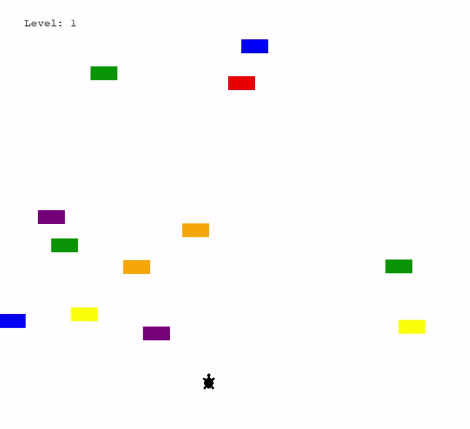

# 🐢 Turtle Crossing Game (Python)

A fun and interactive **Turtle Crossing Game** built using **Python Turtle Graphics** and **Object-Oriented Programming (OOP)**.  
The goal is to help the turtle safely cross the road while avoiding moving cars. With every successful crossing, the difficulty increases.

---

## 🎮 Game Features

- Player-controlled turtle movement
- Randomly generated moving cars
- Collision detection between turtle and cars
- Level-based progression
- Increasing difficulty with each level
- Simple and clean game interface

---

## 🧠 Concepts Used

- Object-Oriented Programming (OOP)
- Game loop and real-time updates
- Collision detection logic
- Keyboard event handling
- Dynamic difficulty scaling
- Modular and maintainable code design

---

## 🛠️ Technologies Used

- **Python 3**
- **Turtle Graphics**
- **Time module**

---

## 🕹️ Controls

| Action | Key |
|------|----|
| Move Forward | `↑` (Up Arrow) |

---

## 📂 Project Structure
```text 
turtle-crossing-game/
│── main.py
│── player.py
│── car_manager.py
│── scoreboard.py
│── README.md
```
## 🚀 How to Run the Game

1. Make sure **Python 3** is installed on your system.
2. Clone this repository:
   ```bash
   git clone https://github.com/Manglam11/turtle_crossing.git
   ```
3. Navigate to the project folder:
   ```bash
    cd turtle-crossing-game
   ```
4. Run the game:
    ```bash
    python main.py
   ```
---

## Demo


---
## 🙌 Learning Outcome

### This project helped me strengthen my understanding of:
- Python OOP principles
- Game mechanics and logic
- Real-time input handling
- Writing clean and modular code

---
## 📌 Author

- Manglam
- B.Tech (Computer Science)
- Bharat 🇮🇳
---
